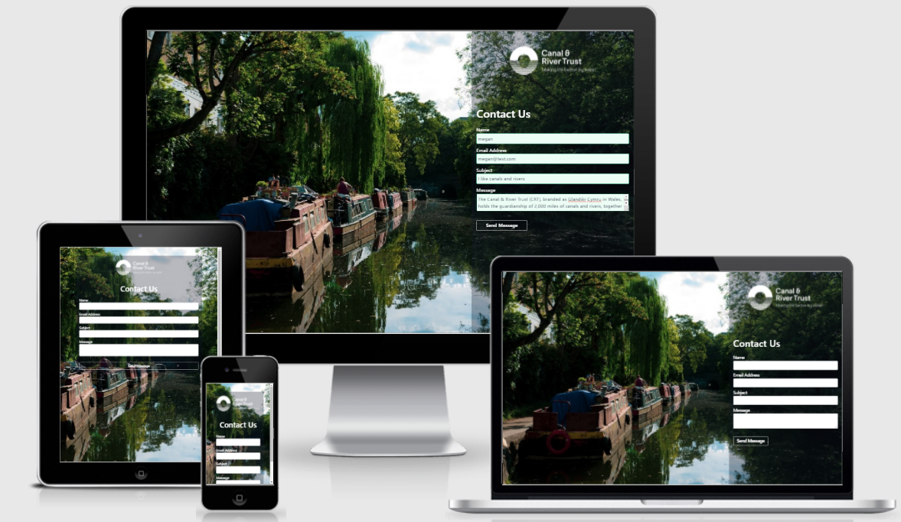

# Interview Contact Us Form



## Suggested Improvements

1. The form renders well on mobile, tablets and desktops.
    - [x] Responsive design built using [Tailwind CSS](#https://tailwindcss.com/docs/guides/create-react-app)
    - [x] [CRACO](https://github.com/gsoft-inc/craco) to override React's PostCSS config
    - [x] Test responsiveness using [Chrome Dev Tools](https://developer.chrome.com/docs/devtools/) and [amiresponsive](http://ami.responsivedesign.is/)

2. The form validates a customer's request.
    - [x] Add required attr to inputs to prevent form submission with empty fields
    - [x] Update correct type attr on inputs
    - [x] Add maxlength to input fields
    - [x] Add validation styles to input fields
    - [] Custom validation messages can be added using [Constraint Validation API](https://developer.mozilla.org/en-US/docs/Learn/Forms/Form_validation#validating_forms_using_javascript)

3. The form guards customers against attacks
    - [] Form should only be accessible by HTTPS
    - [] Add security parameters to fetch headers

4. The form guards the Trust against attacks.
    - [] Protect from spam using [React Re-Captcha](https://www.npmjs.com/package/react-recaptcha)
    - [] Server-side validation of form inputs before sending email/inserting row to DB

5. The use of more third party libraries.
    - [] [React Hook Form](https://react-hook-form.com/) or [Formik](https://formik.org/docs/overview) for form control/validation

6. Better code layout.
    - [] Separate index.js into separate component files
    - [] Add comments throughout all code

7. Application has automated tests.
    - [x] Unit Testing using [Enzyme](https://enzymejs.github.io/enzyme/)
    
        - To run the tests use: 

            ``` npm run test ```
        
        - To run a specific suite of tests use: 

            ``` npm run test <suitename> ```
     
        - To run the tests with coverage reporting use: 
        
            ``` npm run test -- --coverage ```

    - [] Selenium for automated testing in the browser

8. Email send to Trust is replaced with a database system.
    - [] Provison app with an SQL database
    - [] Database Schema: 

        | Name    | Col Name  | Field Type    |
        |---------|---------|---------------|
        | ID (PK) | id      | int           |
        | Recieved Date    | recieved_date    | date     |
        | Email   | email   | varchar(254)  |
        | Name    | name    | varchar(100)  |
        | Subject | subject | varchar(100)  |
        | Message | message | varchar(4000) |
        | Response Date | response_date | date |
        | Responding Staff Member | response_staff | varchar(100) |
        | Response Message | response_message | varchar(4000) |
    
    The cool thing about this is that we can perform some basic reporting by running queries on the database. I've included some examples of things that could be reported on:
    
        1. Response times across certain dates, or for a particular contact id:
            SELECT * FROM contactform WHERE response_date > 2021-07-01 AND response_date < 2021-08-01
            SELECT * FROM contactform WHERE id=4242
            SELECT avg(response_date - recieved_date) as avg_response_time FROM contactform WHERE recieved_date > 2021-01-01
        
        2. Number of contact forms submitted with the same email address:
            SELECT * FROM contactform WHERE email='hansjansen@gmail.com'
        
        3. The subject of contact forms containing a specific keyword:
            SELECT * FROM contactform WHERE subject LIKE '%towpath%'
            SELECT * FROM contactform WHERE message LIKE '%nottingham%' or '%lincoln%'

        4. Responses sent by a specific member of staff:
            SELECT * FROM contactform WHERE response_staff='Aaron'
            SELECT * FROM contactform WHERE response_staff='Paul' AND response_date='2021-01-01'
            SELECT * FROM contactform WHERE response_staff='Peter' AND email="hansjansen@gmail.com"
            SELECT * FROM contactform WHERE response_staff='Victoria' AND subject LIKE '%angry swans%'

## Run Locally

Create a test Ethereal Email account at `https://ethereal.email/` and load those details into `.env`.

Then run:

```js
1. npm install
2. npm run start-app
```

and access the application at `http://localhost:3030/`
## Original Instructions 

Hi Candidate!

This is a demo "Contact Us" form for interview candidates to improve in several ways after we have mangled it to perfection.

### Your tasks
Below are a list of suggested improvements, you are ***not expected to make all*** the suggested improvements within the code but we ***do expect you to complete more than one***.

Choose an improvement to make and complete it such that the form is still rendered out completely i.e. you do not introduce bugs that cause the form to fail to render and we just have a white screen to stare at. We will be assessing it within a browser environment and in your interview, so presentation definitely helps here.

For those suggested improvements that you **do not** make in the code, we want you to think about ***how*** you would make the improvements - we will be covering each improvement area in the interview - so be prepared and consider the improvements altogether and their solutions.

### Suggested Improvements

1. The form renders well on mobile, tablets and desktops.
2. The form validates a customer's request.
3. The form guards customers against attacks.
4. The form guards the Trust against attacks.
5. The use of more third party libraries.
6. Better code layout.
7. Application has automated tests.
8. Email send to Trust is replaced with a database system.


### ...
We're looking forward to how you apply the improvements and then you talking about them with us.